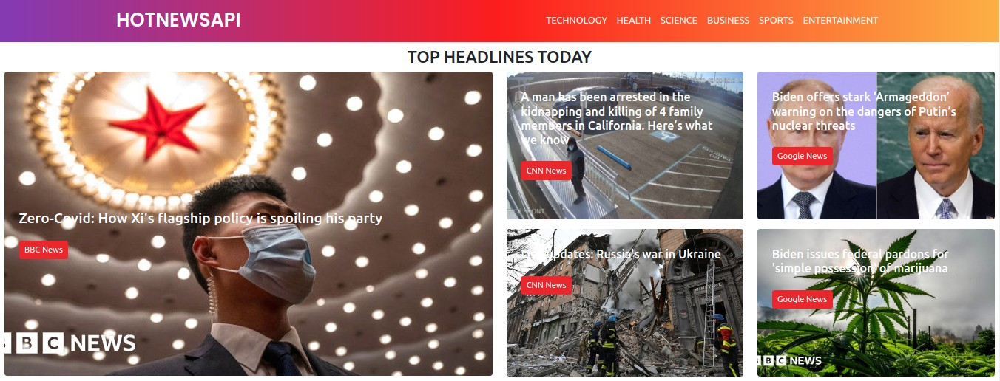
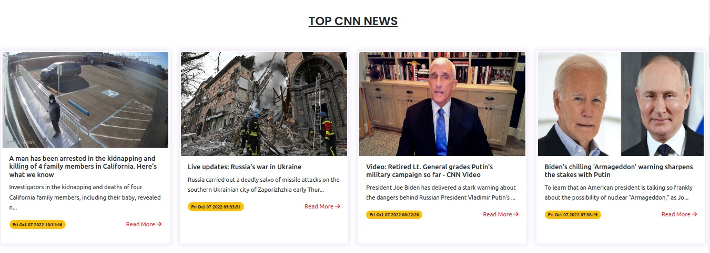
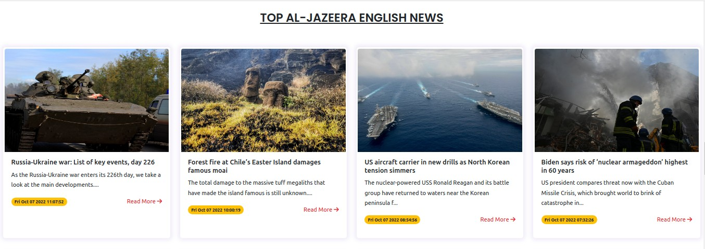
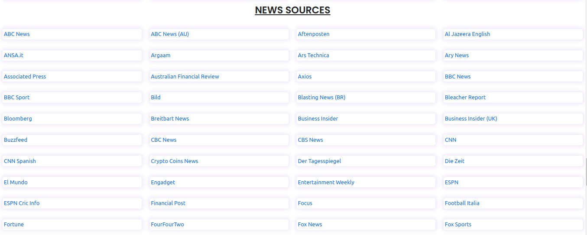
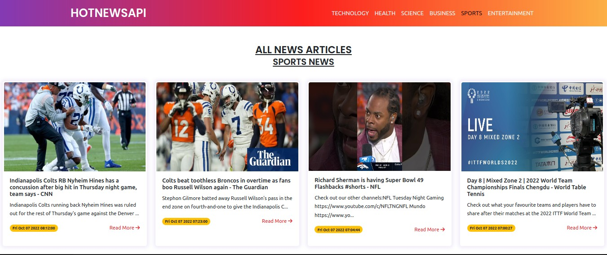

# News Web App
# Contributors of this Project
## By Maureen Njihia on 7th October 2022
# Description
Moringa Phase 2 Independent Project on a News Web App that allows users to:
* View news headlines
* View news articles from various news sources e.g BBC, CNN
* View news articles based on category e.g sports, technology
* View news from a particluar news source
# Setup Requirements
* Git
* Github
* Web Browser (Chrome or Frefox)
* Node.js https://nodejs.org/en/
# Setup Installation
* Copy the link of this repository.
```
https://github.com/Njihia413/News-Web-App.git
```
* Clone it to your local machine.
```
git clone https://github.com/Njihia413/News-Web-App.git
```
* Open terminal and navigate to the directory of the project.
```
cd News-Web-App
```
* Run the following command to install the node modules folder.
```
npm install
```
* Run the web app in development mode.
```
npm start
```
* Open [http://localhost:3000](http://localhost:3000) to view it in your browser.
# Technologies Used
* HTML5
* CSS3
* ReactJS
* Bootstrap 5.2
# Some Screenshots
* Headlines Section

<br/>

* Top CNN News

<br/>

* Top BBC News

<br/>

* Top Al Jazeera News

<br/>

* Top News Sources

<br/>

* News Articles Depending on Category e.g Sports

<br/>

# Known Bugs
There are no known bugs of this project at the moment 😎.
# Support and contact details
For any contributions towards this project:
* Email: developer.njihia@gmail.com
* Phone: 0704592362
# License
Copyright (c) 2022 Moringa School

Permission is hereby granted, free of charge, to any person obtaining
a copy of this software and associated documentation files (the
"Software"), to deal in the Software without restriction, including
without limitation the rights to use, copy, modify, merge, publish,
distribute, sublicense, and/or sell copies of the Software, and to
permit persons to whom the Software is furnished to do so, subject to
the following conditions:

The above copyright notice and this permission notice shall be
included in all copies or substantial portions of the Software.

THE SOFTWARE IS PROVIDED "AS IS", WITHOUT WARRANTY OF ANY KIND,
EXPRESS OR IMPLIED, INCLUDING BUT NOT LIMITED TO THE WARRANTIES OF
MERCHANTABILITY, FITNESS FOR A PARTICULAR PURPOSE AND
NONINFRINGEMENT. IN NO EVENT SHALL THE AUTHORS OR COPYRIGHT HOLDERS BE
LIABLE FOR ANY CLAIM, DAMAGES OR OTHER LIABILITY, WHETHER IN AN ACTION
OF CONTRACT, TORT OR OTHERWISE, ARISING FROM, OUT OF OR IN CONNECTION
WITH THE SOFTWARE OR THE USE OR OTHER DEALINGS IN THE SOFTWARE.